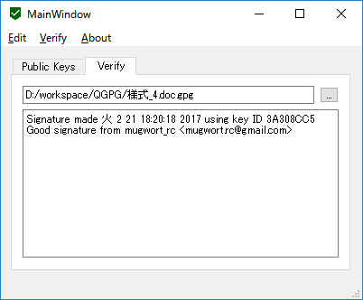

title: QGPG

# QGPG

QGPGはGNU Privacy Guardのユーザーインターフェイスで、GPLv3ライセンスのもと公開されています。

## GNU Privacy Guard

GNU Privacy GuardはOpenPGP([RFC 4880])実装の一つで、デジタル署名や暗号化の機能が提供されています。

QGPGではGPGmeと呼ばれるAPIを使用することで、内部でGnuPGを呼び出し、デジタル署名の検証を行います。

## 使い方

Public Keysには現在読み込まれている公開鍵の一覧が表示されています。

Verifyでファイルを選択すると、署名の検証が行われます。

## ライセンス

* GPLv3
  + QGPG
  + GnuPG
  + GPGme

[RFC 4880]: https://tools.ietf.org/html/rfc4880
